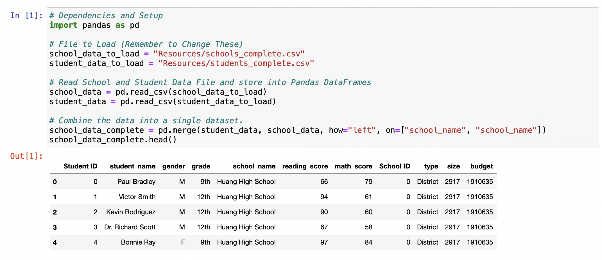
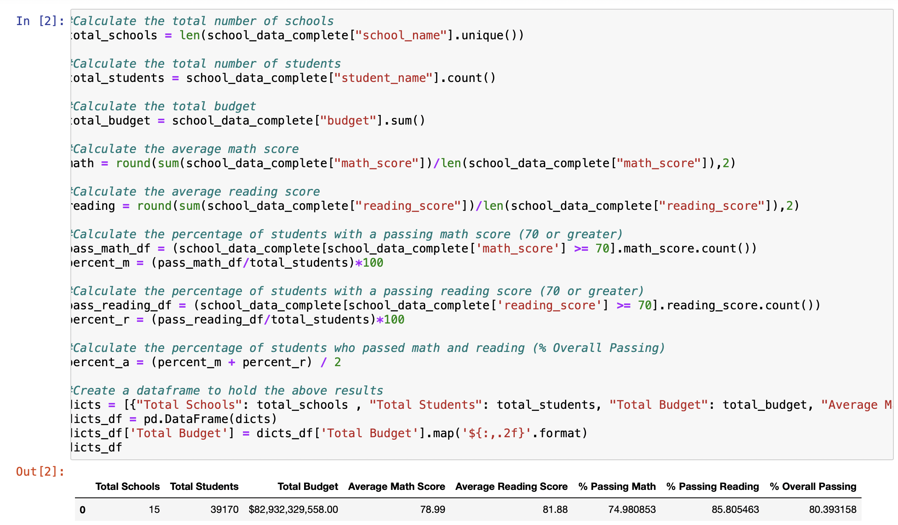
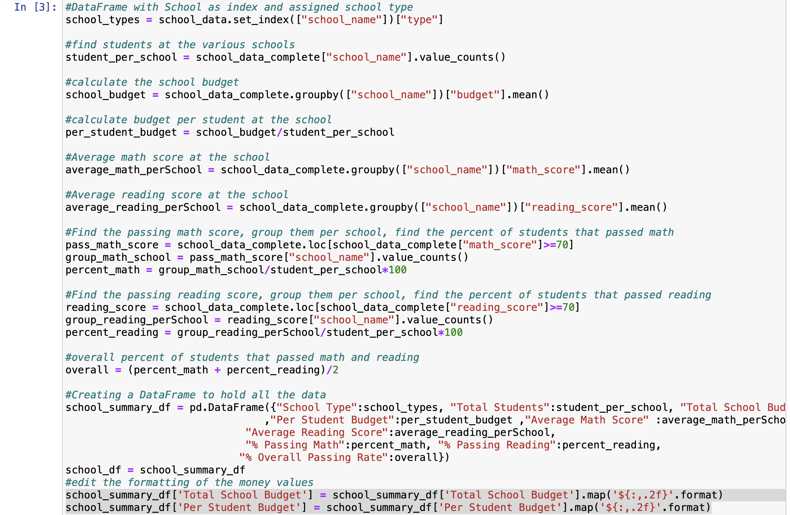
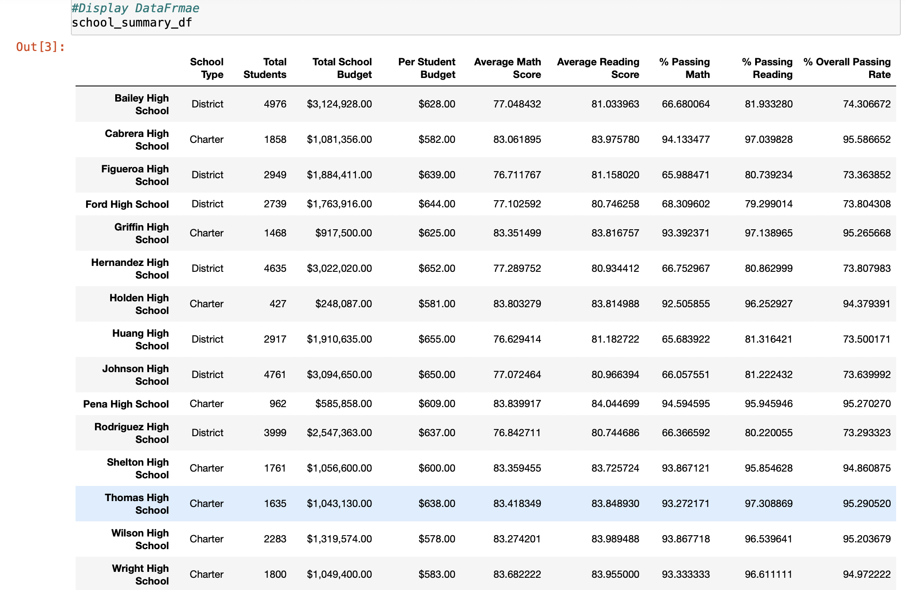
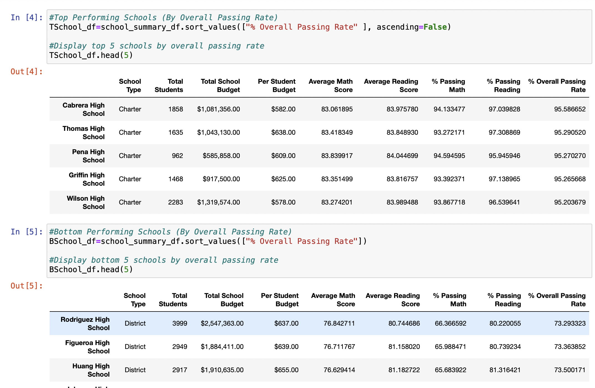
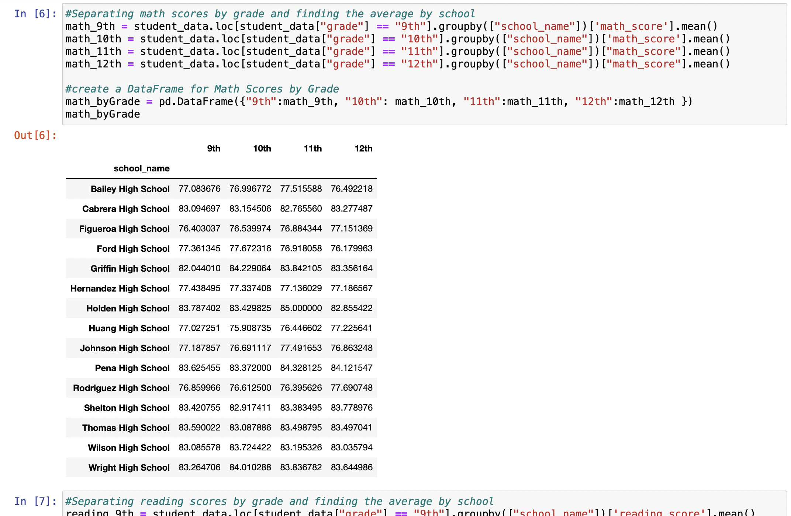
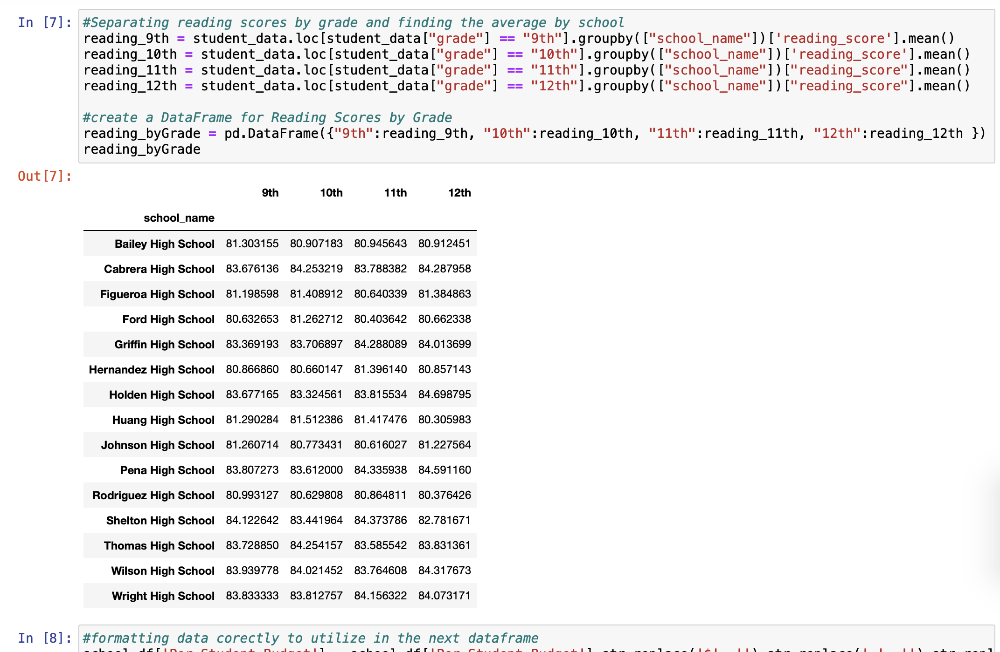
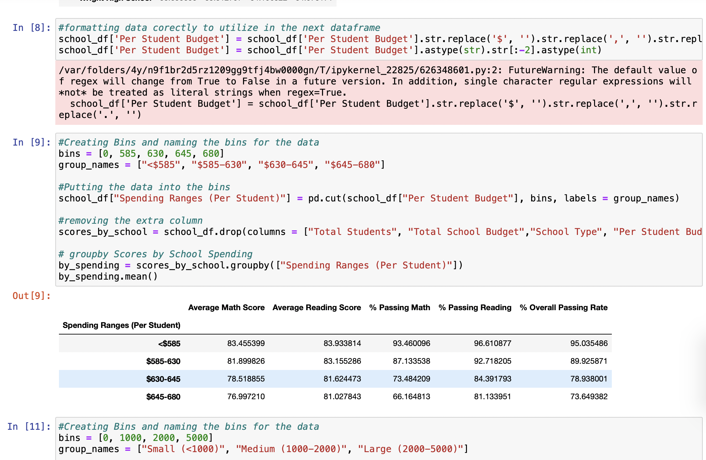
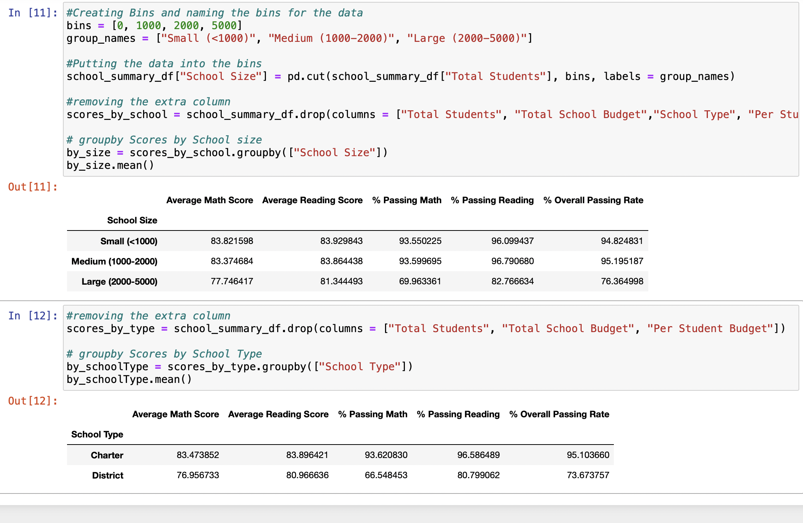

# Pandas_Challenge

## Overview of Project

### PY City Schools Instructions

In this assignment, you’ll create and manipulate Pandas DataFrames and Jupyter Notebook to analyze school and standardized test data.
    *   District Summary
    *   School Summary
    *   Highest-Performing Schools (by % Overall Passing)
    *   Lowest-Performing Schools (by % Overall Passing)
    *   Math Scores by Grade
    *   Reading Scores by Grade
    *   Scores by School Spending
    *   Scores by School Size
    *   Scores by School Type

### Purpose

I am utilizing Pandas and Jupyter Notebook to analyze data from two csv files in order to get more detailed information about what the data shows.

## Analysis and Challenges

### Analysis of Outcomes Based on Goals

* During this assignment I was able to complete all the goals and objectives for the assignment. I used what I have learned in the class to trouble shooting the code as I went with Jupyter Notebook and made sure I was fully understanding what each part of my code did through labeling, so when an error popped up I knew how to approach the problem.

### Challenges and Difficulties Encountered

* I think the biggest challenge for me was figuring out how to group the data into bins as integers when they were formatted as strings. I got through this by removing the extra formatting around the numbers and changing the type of value into a interger instead of a string.

### Jupyter Notebook

## Results

* What are two conclusions you can draw about the data?

    * As the schools get larger the average grades decrease. Smaller schools look to be better at getting the curriculum being assessed across to the students.
    * The Charter Schools have overall a higher passing rate when compared to the District Schools. This could also relate to the size of the schools and abaility to really teach all the students.

* What are some limitations of this dataset?

    * Why did some students not do as well as the others?
    * What are the demographics of the school and funding the school recieved?
        * Did any of these other variables have an impact of the outcome for the students?
